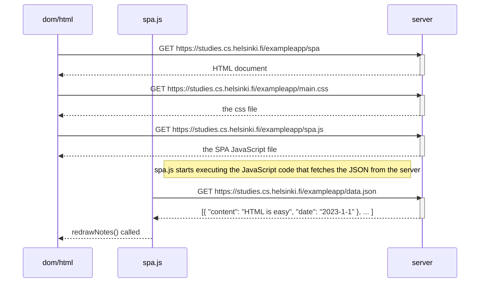

```mermaid
sequenceDiagram
    participant dom as dom/html
    participant spa as spa.js
    participant server

    dom ->> server: GET https://studies.cs.helsinki.fi/exampleapp/spa
    activate server
    server -->> dom: HTML document
    deactivate server

    dom ->> server: GET https://studies.cs.helsinki.fi/exampleapp/main.css
    activate server 
    server -->> dom: the css file
    deactivate server

    dom->>server: GET https://studies.cs.helsinki.fi/exampleapp/spa.js
    activate server
    server-->>dom: the SPA JavaScript file
    deactivate server

    Note right of spa: spa.js starts executing the JavaScript code that fetches the JSON from the server

    spa->>server: GET https://studies.cs.helsinki.fi/exampleapp/data.json
    activate server
    server-->>spa: [{ "content": "HTML is easy", "date": "2023-1-1" }, ... ]
    deactivate server

    spa -->> dom: redrawNotes() called

```
