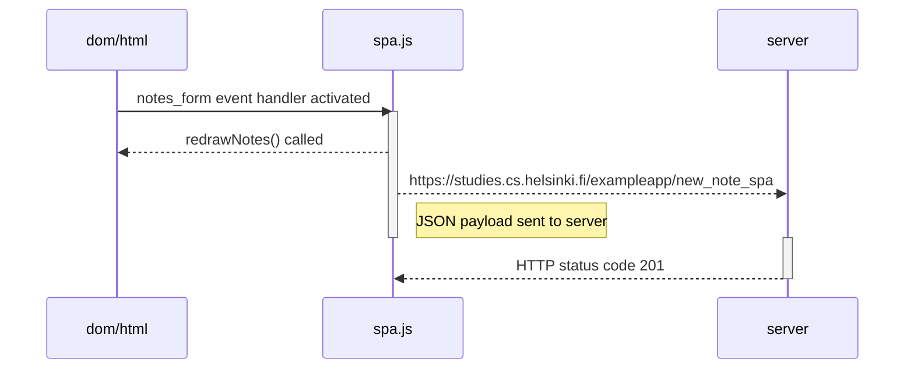

```mermaid
sequenceDiagram
    participant dom as dom/html
    participant spa as spa.js
    participant server

    dom ->> spa: notes_form event handler activated
    activate spa
    spa -->> dom: redrawNotes() called
    spa -->> server: https://studies.cs.helsinki.fi/exampleapp/new_note_spa
    Note right of spa: JSON payload sent to server
    deactivate spa

    activate server
    server -->> spa: HTTP status code 201
    deactivate server
```
